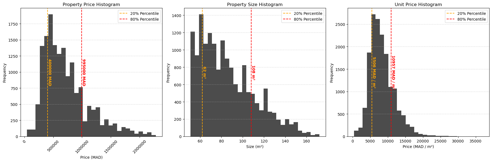

# Moroccan real estate market analysis

## Summary

Scrape, process, analyze, and visualize data from [Avito.ma](https://www.avito.ma/) to uncover current trends in
Morocco's real estate market.

### Expected insights :

- Geographical distribution of real estate properties advertised for sale.
- Current property price and size trends.
- Correlation between price and other property features (Surface, rooms, bathrooms...).

### Snapshots

<table>
    <tr>
        <td style="padding:0;">
            
        </td>
    </tr>
    <tr>
        <td style="padding:0;">
            
        </td>
    </tr>
</table>

## Setup

This project was developed and tested on :
- `Python 3.13.0`
- `Pip 24.3.1`

### 1. Clone the Repository

```shell
git clone https://github.com/itsachrafmansari/moroccan-real-estate-analysis.git
cd ./moroccan-real-estate-analysis
```

### 2. Create new environment (Optional)

Create and activate a new environment with the correct Python version:

#### - Using Pip

```shell
python -m venv mrea_venv
source mrea_venv/bin/activate    # On Linux/MacOS
mrea_venv\Scripts\activate       # On Windows
```

#### - Using Conda

```shell
conda create --name mrea_venv python=3.13
conda activate mrea_venv
```

### 3. Install dependencies

```shell
pip install -r requirements.txt
```

### 4. Install Jupyter (If not already installed)

Ensure Jupyter is installed in the environment:

#### - Using Pip :

```shell
pip install notebook
```

#### - Using Conda :

```shell
conda install -c conda-forge notebook
```

### 5. Lunch Jupyter

Start Jupyter Notebook and navigate to the project folder.

```shell
jupyter notebook
```

### 6. Create the .env file

Create a .env file similar to the .env.example file in the project folder and add the necessary keys such as
[OpenCageData API key](https://opencagedata.com/)

## Usage

### 1. Fetch Data

Open the `A-data-fetching.ipynb` notebook to scrape data from Avito.ma. Ensure the `.env` file is properly configured
with your OpenCageData API key.

Run the cells sequentially to:
- Fetch raw data.
- Save it to `data/raw-fetched-data.csv` and `city-data.csv`.

### 2. Process Data

Open the `B-data-processing.ipynb` notebook to clean and preprocess the raw data.

Run the cells to:
- Perform data cleaning.
- Handle missing values and outliers.
- Save the processed data to `data/processed-data.csv`.

### 3. Analyze and Visualize Data

Open the `C-data-analysis.ipynb` notebook to analyze and visualize the processed data.

Run the cells to:
- Extract insights such as geographical distributions and price trends.

## Disclaimer

This project interacts with data from Avito.ma. As of the time of creation, Avito.ma does not explicitly state any
policies about web scraping (including prohibitions) in their publicly accessible terms of service. Therefore, this
project does not knowingly violate any existing terms. However, users are responsible for ensuring compliance with any
updates to Avito's terms or policies.

## License

This project is licensed under the Creative Commons Attribution-Non Commercial 4.0 International ( [**CC BY-NC 4.0**
](https://creativecommons.org/licenses/by-nc/4.0/.)).

You are free to:

- **Share**: Copy and redistribute the material in any medium or format.
- **Adapt**: Remix, transform, and build upon the material.

Under the following terms:

- **Attribution**: You must give appropriate credit, provide a link to the license, and indicate if changes were made.
- **NonCommercial**: You may not use the material for commercial purposes.

For the full license text,
visit [https://creativecommons.org/licenses/by-nc/4.0/.](https://creativecommons.org/licenses/by-nc/4.0/.)